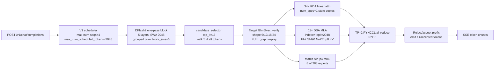

# How the GLM-5.3-Flash NVFP4 2× DGX Spark recipe serves tokens

## Overview

This repo is a GitHub-ready vLLM recipe that serves [LibertAIDAI/GLM-5.3-Flash-NVFP4](https://huggingface.co/LibertAIDAI/GLM-5.3-Flash-NVFP4) across two DGX Spark (GB10, sm_121) nodes at tensor-parallel 2. The checkpoint is 320B total / 18B active, weight-only NVFP4 on routed experts (~181 GiB). Native context is `text_config.max_position_embeddings = 1_048_576`. The published recipe does **not** serve that window. `run.sh` pins `--max-model-len 327680`, `--kv-cache-memory 4445787956` (4.14 GiB fp8), DFlash2 with 5 speculative tokens, and FULL_AND_PIECEWISE CUDA graphs at the 6/12/18/24-token verify shapes.

Token serving is a patched `vllm/vllm-openai:glm53-flash-arm64-cu130` image (`glm53-sm121-v11`) plus a two-rank NCCL process over the QSFP RoCE link. Decode tok/s is limited by hybrid KDA+DSA attention, Marlin NVFP4 MoE, cross-node TP all-reduce, and speculative acceptance — not by the 327,680 software cap. Context is limited by the fp8 KV pin, which materializes a 400,497-token pool (1.22× at 327,680). A 1,048,576-token request is 2.62× that pool and cannot fit.

The frozen decode ruler is `python3 bench_decode.py` from the repo root. Live baseline 2026-08-29 (DFlash2-5, graphs, 327680): prose c=1 median **28.30** tok/s. That is the number to beat; README 28.2 is the same recipe within ~1 tok/s of noise.

## Key Concepts

- **Head / worker.** Rank 0 (`ROLE=head`, `spark1`) owns `0.0.0.0:8000`. Rank 1 (`ROLE=worker`, `spark2`) is `--headless`. Both containers are named `glm53-flash-nvfp4`, host-networked, `--gpus all`.
- **GB10 UMA.** 128 GiB unified CPU/GPU memory per Spark. The KV pin is a UMA occupancy knob, not “free HBM leftover after weights.” Raising it steals bandwidth from weights and activations; dropping it OOMs (`NV_ERR_NO_MEMORY`).
- **Hybrid attention.** 45 text layers: 34 **KDA** (gated linear attention, recurrent state) and 11 **DSA** (`deepseek_sparse_attention`, MLA + indexer top-k 2048). DSA is NoPE (`mla_use_nope`, `qk_rope_head_dim=0`). KDA state is copied once per speculative slot per sequence.
- **NVFP4 / Marlin.** ModelOpt `quant_algo=NVFP4`. Routed MoE is 288 experts, 8 per token, 42 sparse MLP layers + 3 dense. `--moe-backend marlin` selects Marlin NvFp4 over FlashInfer TRTLLM/CuteDSL/CUTLASS.
- **fp8 KV pin.** `--kv-cache-dtype fp8_e4m3` plus `--kv-cache-memory 4445787956` sizes the pool **without profiling**. `--gpu-memory-utilization 0.85` is still passed and ignored for KV bytes.
- **DFlash2.** [incoai/GLM-5.3-Flash-DFlash2](https://huggingface.co/incoai/GLM-5.3-Flash-DFlash2): 1B / 5-layer Qwen3 sliding-window draft (`block_size: 8` in `dflash_config` = 1 bonus + 7 trained draft slots). Method string is `"dflash"`; architecture `DFlash2DraftModel` selects the V2 speculator. Recipe uses **5** of those 7 slots.
- **Verify shape.** Each speculative step presents `1 + num_speculative_tokens` query tokens (bonus + drafts). For DFlash2-5 that is 6; graphs 6/12/18/24 are 1–4 sequences at that shape. README “acceptance on 6 slots” means this verify window, not `num_speculative_tokens=6`.
- **Acceptance length.** From `/metrics` `vllm:spec_decode_*`: `1 + accepted_draft_tokens / num_drafts`. Perfect DFlash2-5 is 6.0. Prose sits ~2.9; structured (count 1→200) ~5.4.
- **Doctor.** `.cursor/skills/verify-glm53-flash/scripts/doctor.sh` is ready only if the API reports `max_model_len=327680` (hardcoded), the image is `glm53-sm121-v11`, and the served name matches. It does **not** check spec slot count or graph ladder.

## How It Works

### 1. `./run.sh` brings up TP=2

`detect_role` is hostname-based (`spark2*` → worker, else head) unless `ROLE=` is set. On the head with `ORCHESTRATE=auto`, the script:

1. `scp`s itself to `spark2:/tmp/glm53-run.sh`.
2. SSHes `ROLE=worker ORCHESTRATE=0` with every serve knob forwarded (`IMAGE`, `MAX_MODEL_LEN`, `KV_CACHE_MEMORY`, `SPEC_CONFIG`, `COMPILATION_CONFIG`, …).
3. Sleeps **25s** so rank 1 is listening on NCCL before rank 0 joins.
4. `start_local 0`, then `wait_ready` polls `http://127.0.0.1:8000/v1/models` for up to 480×5s (~40 min).

`start_local` always `docker rm -f`s the local name first, optionally drops page cache, refuses a missing `glm53-sm121-v11` (stock `vllm/vllm-openai` is not a fallback), and `docker run`s host-network with `/dev/infiniband`, `IPC_LOCK`, and the HF cache bind-mounted. Rank 0 gets `--host 0.0.0.0 --port 8000`; rank 1 gets `--headless`. Both get `--tensor-parallel-size 2 --nnodes 2 --distributed-executor-backend mp --master-addr 10.100.8.1`.

NCCL is pinned because GB10 exposes four HCAs and two are DOWN:

- `NCCL_IB_HCA=rocep1s0f1`, `NCCL_NET=IB`, `NCCL_IB_DISABLE=0`, `NCCL_CROSS_NIC=1`
- `NCCL_NVLS_ENABLE=0`, `NCCL_CUMEM_ENABLE=0` (sm_121 has no MNNVL multicast; logs fall through to PYNCCL)
- `NCCL_SOCKET_IFNAME` / `GLOO_SOCKET_IFNAME` / `TP_SOCKET_IFNAME=enp1s0f1np1`

Unpinned NCCL picks a dead HCA and dies with `unhandled system error`. Boot logs show `vLLM is using nccl==2.30.7`.

```mermaid
sequenceDiagram
    participant User
    participant Head as spark1 run.sh
    participant Wssh as spark2 via SSH
    participant C0 as glm53-flash-nvfp4 rank0
    participant C1 as glm53-flash-nvfp4 rank1
    participant API as :8000 /v1
    User->>Head: ./run.sh
    Head->>Wssh: scp run.sh; ROLE=worker
    Wssh->>C1: docker run --headless --node-rank 1
    Head->>Head: sleep 25 (NCCL listen)
    Head->>C0: docker run --host 0.0.0.0 --node-rank 0
    C0->>C1: NCCL TP=2 (RoCE HCA rocep1s0f1)
    Head->>API: poll /v1/models (up to 40 min)
    API-->>User: Ready
```

Published `docker inspect` Cmd (what `run.sh` defaults emit):

`--max-model-len 327680 --kv-cache-dtype fp8_e4m3 --kv-cache-memory 4445787956 --max-num-seqs 4 --block-size 2304 --moe-backend marlin --speculative-config {"method":"dflash",...,"num_speculative_tokens":5} --compilation-config {"cudagraph_capture_sizes":[1,2,4,6,12,18,24]}`

`SPEC=mtp ./run.sh` swaps the spec JSON to `{"method":"mtp","num_speculative_tokens":4}` (native `num_nextn_predict_layers=1` plus MTP-4). MTP runs on v8; DFlash2 needs v11.

### 2. The v8–v11 image chain is load-bearing

Stock `vllm/vllm-openai:glm53-flash-arm64-cu130` loads on sm_121 and will echo a prompt. It is the wrong MLA backend, the wrong FlashInfer, and it has no DFlash2. `run.sh` refuses to start if `glm53-sm121-v11` is missing.

| Layer | From | What it patches |
|---|---|---|
| **v8** | stock `glm53-flash-arm64-cu130` | Prefer `FLASHINFER_MLA_SPARSE_SM90` on compute 12; SM90 wrapper uses **FA2** (not FA3) when `major != 9`; FlashInfer **0.6.18** (0.6.17 FA2 MLA NaNs on 64–256 row batches); NCCL **2.30.7** + cutlass-dsl 4.6.2 re-pin; **PDL off** on SM12x (`is_arch_support_pdl` only 9/10 — PDL races KDA state kernels); indexer top-k init to `-1` + kpool clamp (`patch_v7.py`); fp8 MLA tile cap and sm12x gate (`patch_v8_fp8.py`). |
| **v9** | v8 | DFlash2 backport of vLLM PR [#52816](https://github.com/vllm-project/vllm/pull/52816) (`dflash2_backport.diff`, `--fuzz=0`). Forces V2 speculator when the draft arch is `DFlash2DraftModel` (V1 would silently degrade to DFlash1). |
| **v10** | v9 | Fork-only `Glm5Next` grows `SupportsEagle3` / `EagleModelMixin`. DFlash reads `dflash_config.target_layer_ids` `[5,14,24,33,42]` through that interface. Capture is the completed previous-layer output, contracted from mHC’s 4 streams by averaging (`hc_mult=4`), matching sglang [#36708](https://github.com/sgl-project/sglang/pull/36708). Without this, TP ranks die with “Model does not support EAGLE3 interface”. |
| **v11** | v10 | GLM-5-Next bespoke KV grouping only admitted MLA / mamba / kpool. DFlash’s five `SlidingWindowSpec` layers made it bail to a generic path that cannot unify the indexer’s ~33 B/token page. v11 carves a **draft KV group**, resizes draft blocks to `max(attn_block/4, 16)` so a 2048-token window costs ~3 block ids instead of burning `sliding_window/16` ids, and charges those pages on every pool block. |

Live workers then select:

- `FLASHINFER_MLA_SPARSE_SM90` (HND layout), FA2 NoPE
- `'MARLIN' NvFp4 MoE backend`
- V2 model runner, `quantization=modelopt_fp4`
- DeepGEMM E8M0 enabled; `--block-size 2304` because arch-12 fp8 paged-MQA only accepts **64-entry** pool pages (2304 = 36×64)

Sparse MLA logs `No MLA prefill backend supports this model; sparse MLA will use the top-k MQA path only (no dense-MHA prefill)`. Long prefill is the indexer + paged MQA path, not a dense MHA warmup.

### 3. Context cap: 327,680 is a pin, not RoPE

`config.json` → `text_config.max_position_embeddings = 1048576`. The draft checkpoint says the same. vLLM then:

1. Loads the target at `--max-model-len 327680` (`Using max model len 327680`).
2. Resolves the draft at its native 1,048,576.
3. **Overrides** draft max model len `from 1048576 to 327680` (`speculative.py`).

`--kv-cache-memory 4445787956` skips CUDA memory profiling for the KV pool. Measured pool on this pin: **400,497 tokens**, identical eager or graphs, 1.22× the 327,680 window (one full-length sequence plus 22% slack). Four `max-num-seqs` do **not** each get 327k; they share the same 400k tokens, which is why decode occupancy is short-context.

A 1,048,576-token request needs 2.62× that pool (`400497 / 1048576 ≈ 0.38`). fp8 KV cannot buy 1M on 2× GB10:

- Drop the pin → `NV_ERR_NO_MEMORY`.
- 5.0 GiB boots but decode drops ~20% at every concurrency (UMA pressure).
- 5.14 GiB crashes under concurrent load.
- Tony ladder: every try ≥5.5 GiB is NVRM OOM.

The public 2× 1M result (drowzeys) switches KV format to packed `nvfp4_ds_mla` (~368 B/token vs ~656 B fp8 MLA), `block-size 7168`, `max-num-seqs 2`, and still only decodes ~22 tok/s. That is a context win that loses the decode hill. Do not claim a 1M **fp8** boot that cannot actually admit a 1M request.

`--max-model-len 327680` is therefore the largest round window that (a) fits the 4.14 GiB fp8 pool with headroom, (b) keeps `max-num-seqs=4` plus DFlash2-5 KDA copies, and (c) still needles: a 318,123-token prompt (97% of 327,680) prefilled in 4m05s and answered exactly.

Doctor hardcodes this: `max_model_len != 327680` → `status=mismatch`. A real 1M serve would fail doctor even if `/v1/models` answered.

### 4. One decode step (DFlash2-5 + graphs)



DFlash2 is block diffusion, not token-wise MTP. One draft forward produces the whole block. `DFlash2Qwen3DecoderLayer` wraps attention and MLP with `DFlashGroupedConv` whose `block_size = 1 + num_speculative_tokens` (6 in the recipe, 8 as trained). The V2 speculator (`qwen3_dflash2.py` + `DFlash2Speculator`) takes aux hidden states from the five tapped target layers, scores `selector_top_k=16` candidates, and writes a path into `draft_tokens`. The target then verifies that path in one FULL CUDA graph.

vLLM rounds capture sizes up to multiples of `num_speculative_tokens+1`. Recipe `COMPILATION_CONFIG` lists `[1,2,4,6,12,18,24]`. Engine resolves `cudagraph_mode=FULL_AND_PIECEWISE` even though the JSON does not set a mode; `VLLM_USE_BREAKABLE_CUDAGRAPH=1` auto-enables. Capture is ~27 s at zero measurable extra KV (same 400,497-token pool as eager). Measured vs eager the same day: **+2–5% at c=1/2, flat at c=4**, acceptance unchanged. Greedy output stays lossless; a counting probe held 100+ exact sequential tokens per stream at c=4 through graph replay.

Why 5 slots, not 7: positions 5–6 accept under 15%, and every extra slot costs a KDA state copy (`num_spec+1` copies per sequence). At 7 slots the 4th of `max-num-seqs=4` no longer fits the pool and queues ~10 s; at 5 slots all four admit immediately and c=1 is also faster (26.8 vs 26.0 in that ladder). 4 slots truncates the block too hard (acceptance 2.8, c=1 → 20.6). Slot 6 is the only untested integer on this image at `max-num-seqs=4` (hypothesis H1: graphs 7/14/21/28).

Engine warning on every boot: `max_num_scheduled_tokens is set to 2048 based on the speculative decoding settings`. That is the leftover batching knob (H2). Prefill of a near-max window is chunked at 2048 regardless of `block-size 2304`.

### 5. What actually caps decode tok/s

The 28 tok/s prose floor is the product of several serial costs, not a single kernel:

1. **Acceptance.** Prose draft accept ~0.38 → acceptance length ~2.9, so most of the 5-slot verify is wasted. Structured accept ~0.88 → ~5.4, which is why structured c=1 is 50.7 tok/s on the same kernels. The primary metric is the low-acceptance regime on purpose.
2. **Hybrid attn.** 34 KDA layers keep recurrent state (the copy tax above). 11 DSA layers run sparse MLA through FlashInfer FA2 SM90 on fp8 KV, indexer top-k 2048, kpool compress. No dense-MHA prefill backend.
3. **Marlin NVFP4 MoE.** Weight-only FP4 dequant + 8-of-288 routing every sparse layer. Marlin won the backend picker on this image; the FlashInfer NVFP4 options are present and unused.
4. **Cross-node TP.** 18B active still all-reduces every layer over QSFP RoCE via PYNCCL. No NVLS, no custom AR, no MNNVL.
5. **Graphs vs launch overhead.** FULL graphs recover 2–5% at c=1/2 and nothing at c=4 — occupancy is already kernel-bound. Previously `--enforce-eager` was required on sm_121; that regression is closed.
6. **UMA + KV pin.** 4.14 GiB is the decode-friendly pin. Bigger KV slows decode. InstantTensor (not in this recipe) killed TP=2 ranks here.
7. **PDL off.** Correctness on SM12x, not a speedup.

MTP-4 (eager, 262144 context) measured 24.7 / 20.9 / 16.6 per-stream prose the day DFlash2-5 landed. DFlash2-5 wins every concurrency and carries 25% more context. That is why it is the default.

Leftover knobs on this image (do not stack; see `evidence/hypotheses.md`): DFlash2-6; `--max-num-batched-tokens` 3072/4096; DFlash2-7 at `max-num-seqs=2`; packed NVFP4 KV for a 1M lane; inductor compile; draft FA4 if present.

### 6. `bench_decode.py` is the ruler

The published command is `python3 bench_decode.py` (both phases, `--runs 3`, `--concurrency 1 2 4`, `--max-tokens 200`, `temperature` hardcoded 0, thinking off). It streams `/v1/chat/completions`, drops the first completion token from the decode rate (`decode_tokens = max(completion-1, 0)` over wall after first token), and diffs Prometheus `vllm:spec_decode_{num_drafts,num_draft_tokens,num_accepted_tokens}_total` around each concurrency block.

Two regimes exist so a “faster” spec change cannot hide behind counting:

| phase | c | median_decode_tok_s | median_agg | acceptance_len | draft_acc | source |
|---|---:|---:|---:|---:|---:|---|
| prose | 1 | **28.30** | 28.30 | 2.875 | 0.375 | `evidence/baseline-bench.txt` 2026-08-29 |
| prose | 2 | 22.61 | 44.17 | 3.114 | 0.423 | same |
| prose | 4 | 16.99 | 65.70 | 3.004 | 0.401 | same |
| structured | 1 | 50.74 | 50.73 | 5.405 | 0.881 | same |
| structured | 2 | 41.78 | 83.54 | 5.423 | 0.885 | same |
| structured | 4 | 34.87 | 136.36 | 5.445 | 0.889 | same |

README table (28.2 / 21.1 / 17.1 prose, 51.4 / 41.5 / 35.7 structured) is the published graphs-vs-eager capture for the same recipe. Hillclimb uses the frozen-harness JSON above; noise vs README is ~1 tok/s. First wave after restart pays Triton JIT; TTFT is not comparable until a warm wave (0.23–0.65 s).

`count_probe.py` is a losslessness gate (need ≥80 consecutive integers), not a tok/s ruler.

## Where Things Live

| Path | Role |
|---|---|
| [`run.sh`](../run.sh) | Orchestration, defaults, `SPEC_CONFIG`, graph ladder, docker Cmd |
| [`stop.sh`](../stop.sh) | `docker rm -f` local + SSH worker |
| [`bench_decode.py`](../bench_decode.py) | Frozen decode harness |
| [`README.md`](../README.md) | Published table, image build, smoke curl |
| [`docker/Dockerfile.sm121-v8`](../docker/Dockerfile.sm121-v8) … [`v11`](../docker/Dockerfile.sm121-v11) | Image chain |
| [`docker/dflash2_backport.diff`](../docker/dflash2_backport.diff) | DFlash2 V2 speculator + grouped conv |
| [`docker/patch_v10_dflash_glm5.py`](../docker/patch_v10_dflash_glm5.py) | mHC aux-hidden capture |
| [`docker/patch_v11_dflash_kv_groups.py`](../docker/patch_v11_dflash_kv_groups.py) | Draft KV group |
| Target `config.json` snapshot `aa28e1f5…` | Native 1,048,576, hybrid layer map, NVFP4 |
| Draft `config.json` snapshot `7d74cdd8…` | `dflash_config.block_size=8`, SWA 2048 |
| [`.cursor/skills/verify-glm53-flash/scripts/doctor.sh`](../.cursor/skills/verify-glm53-flash/scripts/doctor.sh) | Ready/mismatch; hardcodes 327680 |
| [`evidence/hypotheses.md`](./hypotheses.md) | Next one-at-a-time knobs |
| [`evidence/baseline-bench.txt`](./baseline-bench.txt) | Frozen SUMMARY JSON |

## Gotchas

- **Recipe Cmd vs live Cmd.** Published defaults are DFlash2-5 / graphs 6/12/18/24. Live `docker inspect` can differ the moment a hillclimb exports `SPEC_CONFIG` / `COMPILATION_CONFIG` and restarts. Doctor will still say `ready` as long as `max_model_len=327680` and the image/name match. At the time this was written the lab container had been restarted with DFlash2-6 / 7/14/21/28 (H1) and was still loading weights; that is **not** the frozen baseline.
- **“6 slots” ≠ `num_speculative_tokens=6`.** 5 speculative tokens + 1 bonus = 6-token verify. The draft’s trained `block_size` is 8 (7 slots). Mixing these three integers is the usual misread of README, `run.sh` comments, and `dflash_config`.
- **Architecture-model ratio slip.** “A 1M request is 0.38× of that pool” inverts the fraction. The pool is 0.38× of 1M; the request is 2.62× the pool and does not fit.
- **GitHub About still says 262k / MTP-4.** Clone files on `origin/main` match this recipe (327680, DFlash2-5). Recipe-lint checks files, not the GitHub description.
- **`--gpu-memory-utilization` does not size KV** when `--kv-cache-memory` is set. Do not “fix” OOM by raising UTIL.
- **`--block-size 2304` is not a context lever.** It tiles DeepGEMM’s 64-entry fp8 pages. drowzeys’ 7168 is a different KV format.
- **Thinking-off is not a content filter.** `--default-chat-template-kwargs '{"enable_thinking": false}'` plus the bench/smoke `chat_template_kwargs` still sometimes leak chain-of-thought into `message.content` (H6, stock template). Smoke only requires non-empty content.
- **First boot is 15–20 minutes** with a warm HF cache (120 shards, 181 GiB, prefetch disabled because the checkpoint exceeds 90% of available RAM). `wait_ready` is the signal, not the 25s NCCL sleep.
- **Do not enable InstantTensor.** It killed TP=2 ranks on this cluster.
- **Do not unpin `NCCL_IB_HCA`.**
- **`./run.sh` is destructive.** It `docker rm -f`s `glm53-flash-nvfp4` before start. Attach-or-refuse if `owned_by_verify=0`.
- **One TP=2 serve.** Host network, port 8000, container name, and both GPUs are singleton. Measurement is serial. Restart owns the lab containers.
